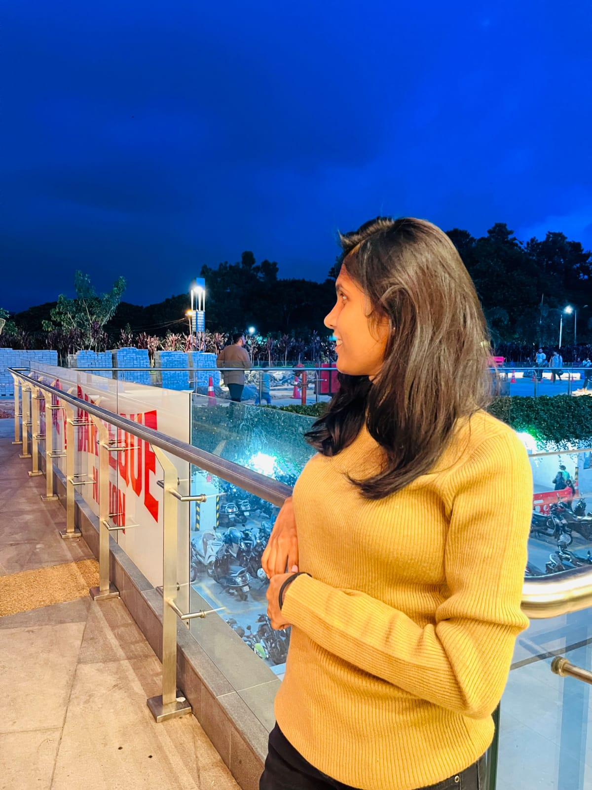

----------------------------------------------------------
# Shabna Shaik

My name is Shabna Shaik, and I'm passionate about technology and the great adventure activities. I love hiking and exploring new places.



------------------------------------------------------------
## Stay Active with These Choices

Searching for exciting ways to keep fit and active? Look no further! Below, you'll find a selection of sports I enjoy, each with its unique reasons for recommendation, along with the weekly hours to invest in these activities.

| Sport Name       | Reason for Recommendation             | Hours per Week |
|------------------|---------------------------------------|----------------|
| Tennis           | Great for improving agility and focus | 4              |
| Hiking           | A fantastic way to connect with nature| 6              |
| Swimming         | Excellent full-body workout           | 5              |
| Cycling          | Eco-friendly and fun transportation   | 3              |

--------------------------------------------------------------
## Pithy Quotes by Scientists

> "Science is the great adventure of our time." - Carl Sagan

> "The only source of knowledge is experience." - Albert Einstein

## Code Snippet and Stack Overflow with Q & A

> [*Stack Overflow Question Title*](https://css-tricks.com/snippets/sass/placing-items-circle/)
> 
> Block quoted question content from Stack Overflow.

```


@mixin on-circle($item-count, $circle-size, $item-size) {
  position: relative;
  width:  $circle-size;
  height: $circle-size;
  padding: 0;
  border-radius: 50%; 
  list-style: none;       
  
  > * {
    display: block;
    position: absolute;
    top:  50%; 
    left: 50%;
    width:  $item-size;
    height: $item-size;
    margin: -($item-size / 2);
  
    $angle: (360 / $item-count);
    $rot: 0;

    @for $i from 1 through $item-count {
      &:nth-of-type(#{$i}) {
        transform: 
          rotate($rot * 1deg) 
          translate($circle-size / 2) 
          rotate($rot * -1deg);
      }

      $rot: $rot + $angle;
    }
```

[Source: CSS Tricks for Styling Buttons](https://css-tricks.com/snippets/)